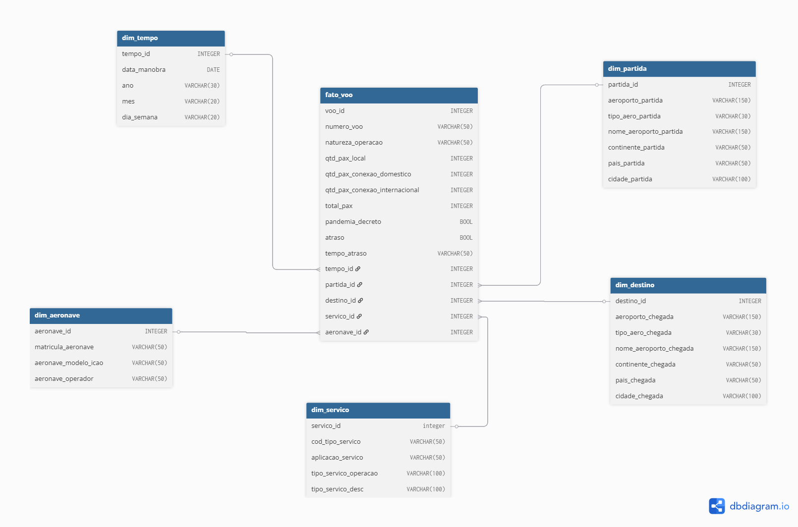
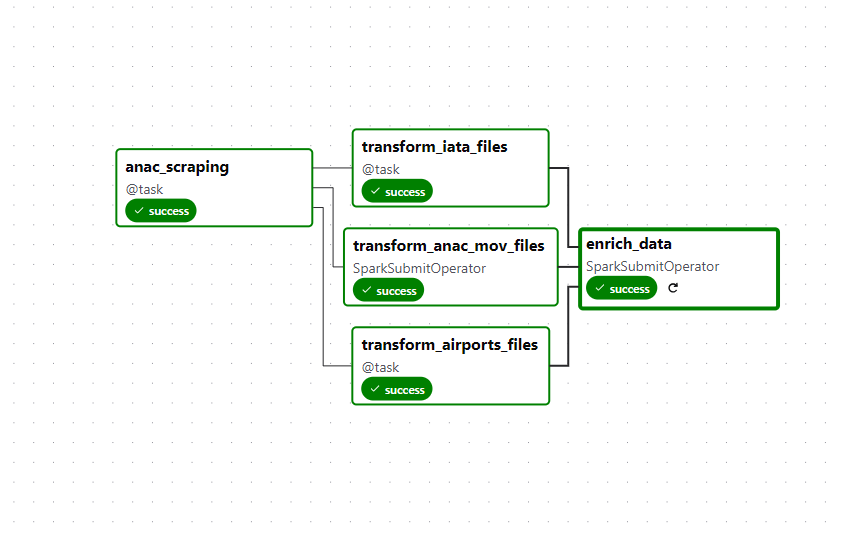
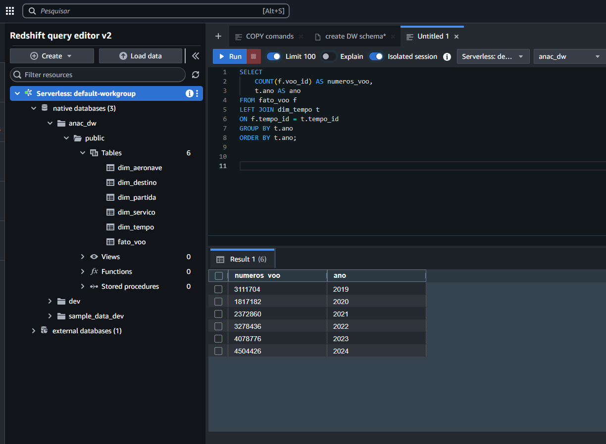

# 🛬 😷 Data Warehouse para análise de movimentações aeroportuária entre 2019 e 2024

Este projeto tem como objetivo a construção de um Data Warehouse utilizando dados abertos da **ANAC**, **DataHub** e **Scraping de Dados** para análise da movimentação aeroportuária, entre 2019 e 2024, e os impactos deixados pela Covid-19 durante o respectivo período.
A fonte principal é o [portal de dados abertos da ANAC](https://www.gov.br/anac/pt-br/acesso-a-informacao/dados-abertos), que disponibiliza diversas informações sobre a atividade aérea brasileira.

---

## 🔗 Fontes

- [Portal de Dados Abertos da ANAC - Segurança Operacional](https://www.gov.br/anac/pt-br/acesso-a-informacao/dados-abertos/areas-de-atuacao/operador-aeroportuario/dados-de-movimentacao-aeroportuaria/metadados-operador-aeroportuario-dados-de-movimentacao-aeroportuaria)  
- [Plataforma DataHub](https://datahub.io/core/airport-codes)

---

## 🧰 Ferramentas Utilizadas

- Python
- Apache Spark
- Apache Airflow
- Amazon S3
- Amazon Redshift

## 📐 Modelagem Dimensional

  

---

## ▶️ Airflow 

  

## 📈 Data Warehouse

  

